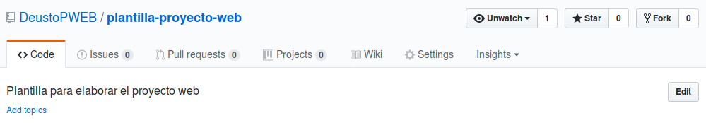

## Índice / Tabla de contenidos

1. [SEMANA 1](0-introduccion.md)
2. [SEMANA 2](1-estrategia.md)
3. [SEMANA 3](2-alcance.md)
4. [SEMANA 4](3-estructura.md)
5. [SEAMANA 5](4-esqueleto.md)
6. [SEMANA 6](5-superficie.md)
7. [SEAMANA 7](6-A.md)
8. [SEAMANA 8](6-B.md)
9. [SEAMANA 9](6-C.md)
10. [SEAMANA 10](6-D.md)
11. [SEAMANA 11](6E.md)
12. [SEAMANA 12](6-F.md)
13. [SEAMANA 13](6-G.md)
14. [SEAMANA 14](6-H.md)
15. [conclusion](6-I.md)
16. [Referencias](6-J.md#referencias)
# PAGINA

Este repositorio es una plantilla para elaborar el proyecto web de la asignatura Proyectos para la web. Presentado como libro [mediante GitBook](https://www.gitbook.com/book/deustopweb/plantilla-libro-pweb/).

## Recomendaciones para el flujo de trabajo

- Designad a un miembro del grupo como responsable de la gestión del repositorio (en adelante _admin_)
- Cuando empecéis a trabajar en el contenido de un apartado, 
    1. decidid qué subsecciones tendrá cada documento;
        + (lo más lógico sería que acordéis un esquema para la unidad en la que estás trabajando durante alguna de vuestras reuniones _en persona_)
    2. introducid ese esquema en el/los documento(s);
        + (esto podría ser una tarea que realice el admin de vuestro grupo, para evitar conflictos entre versiones en este punto) 
    3. estableced quién redactará cada parte/subsección del esquema.
    
    Así es más fácil que GitHub sea capaz de resolver los conflictos por sí mismo
- Cuando estéis trabajando individualmente en la(s) parte(s) que os corresponden, 
    1. cread un nuevo branch, por ejemplo `cap-1.2.3` para trabajar el subapartado 1.2.3 de vuestro esquema (que habréis decidido y definido en una reunión del equipo, como se ha detallado en el punto anterior);
    2. realizad vuestras ediciones y commits en ese branch;
    3. cuando ese trabajo (el subapartado 1.2.3) esté listo para ser revisado por el resto de compañeros, haced un pull request en vuestro repositorio de grupo;
        + (debatid en el pull request, y seguid haciendo cambios y commits en el branch, hasta que estéis satisfechos con el contenido)
    4. cuando todos estéis de acuerdo en que ese contenido está finalizado y listo para ser incluido en el trabajo, haced merge del pull request (preferiblemente, decidid que sea sólo el usuario admin quien haga los merges). En este momento el contenido del subapartado 1.2.3 estará incluido en el branch principal o master de vuestro proyecto;
    + eliminad el branch de trabajo `cap-1.2.3`

Recordad que este trabajo, aunque lo realicemos mediante texto plano y estemos trabajando sobre fragmentos breves cada vez, tiene que cumplir con las [Normas de presentación de trabajos escritos](https://alud.deusto.es/mod/resource/view.php?id=123494) tal y como exige la universidad, y tiene que estar redactado utilizando [Markdown](https://github.com/DeustoPWEB/pweb2017/blob/master/markdown.md) (a través de un editor de texto plano, para vuestra comodidad) tal y como exigen los requerimientos de esta asignatura.

No caigáis en la tentación de trabajar "fuera" de Sublime/GitHub (por ejemplo, en Word o Google Docs) y luego, de vez en cuando, volcar el trabajo realizado en algún otro sitio en vuestro repositorio. El proceso de trabajo con GitHub es parte del aprendizaje de esta asignatura.

Por supuesto, si tenéis cualquier duda a lo largo de vuestra elaboración del proyecto con GitHub, ya sea durante alguna reunión del equipo o cuando estéis trabajando individualmente, **por favor comunicadlo** a través de un issue bien en vuestro repositorio de equipo o incluso en el [repositorio de la asignatura](https://github.com/DeustoPWEB/pweb2017/issues) (si es alguna cuestión más general), mencionándome con una @ (@mberasategi, para que pueda recibir una notificación y atender vuestra consulta).

## Cómo empezar a trabajar

Primera tarea: actualizar vuestra plantilla, porque he añadido estas instrucciones acerca de cómo arrancar. Para esto, veréis que he creado un pull request en vuestro repositorio de grupo. Este pull request lo que hace es solicitar que _traigáis_ las actualizaciones del _repositorio plantilla original_ ([plantilla-proyecto-web](http://https://github.com/DeustoPWEB/plantilla-proyecto-web)) a vuestra copia. Lo primero es hacer merge de ese pull request, haciendo clic en el botón **Merge pull request** (basta con hacerlo una sola vez, así que lo puede hacer el admin de vuestro grupo).

En segundo lugar, tenéis que hacer que esto deje de ser una plantilla y empiece a ser vuestro proyecto. Para esto (tarea de una sola vez también, así que puede hacerla el usuario admin cuando estéis todos juntos para que lo veáis y os podáis ayudar en caso de que surjan problemas),

1. editad la descripción del repositorio. Clic en el botón **Edit** en la parte superior derecha de vuestro repositorio, al lado de la descripción que de momento dice "Plantilla para elaborar el proyecto web"; introducid ahí la descripción de vuestro proyecto ("Sitio web para revista tal", o "Web de medio de comunicación cual"). Si en un momento dado hacéis un sitio web con vuestro repo utilizando GitHub Pages (no es obligatorio), podéis también introducir la URL de ese sitio web aquí

  

2. este archivo README será como el índice a los diferentes capítulos de vuestro proyecto, y todas estas explicaciones para empezar a trabajar las podéis eliminar (quedarán en el [_repositorio plantilla original_](http://https://github.com/DeustoPWEB/plantilla-proyecto-web) para futuras referencias). Hay que, por tanto, añadir un índice por un lado, y eliminar el contenido que ya existe por el otro
    - si queréis guardaros una copia de estas instrucciones en vuestro repositorio, copiad todo el texto de este documento **hasta la línea de guiones un poco más abajo** y pegadlo en un documento nuevo (podéis llamarlo `instrucciones.md` por ejemplo, o como os parezca). Una vez guardéis ese documento, tendréis que añadirlo al commit en GitHub Desktop para que se sincronice, y ya podéis eliminarlo de este documento (si necesitáis ayuda, issue, como siempre). Si no queréis guardaros copia, simplemente eliminad todo el texto que hay en este documento hasta la línea de guiones
    - para añadir el índice, quedaros solamente con el contenido que hay debajo de la línea de guiones (la línea de guiones en sí eliminadla también). Los diferentes capítulos ya están enlazados, así que solo tenéis que modificar el título y la descripción. Luego, según vayáis añadiendo subapartados a vuestros capítulos, podréis ir añadiéndolos y enlazándolos desde aquí

--------------------

# Título de vuestro proyecto web

Descripción...

